# Checker

Checker is per circuit precheck and postcheck utility to be used when migrating circuits from one device to another, or when migrating a subset of circuits on a single device. Checker is launched from Jenkins and with a few parameters will log into the network device, check the provided circuits, and email a report with a summary table, per-circuit diff analysis, and a html file containing show command diffs. The initial release supports Juniper MX routers and up to 9 signature profiles covering various circuit types with planned support for future hardware and circuit types.

Checker was developed in Python, is version controlled in GitLab, launched from Jenkins, documented in Confluence, and utilizes a SQLite3 database to store information between precheck and postcheck runs. This Confluence page is divided into a user guide and development guide, feature requests and bug scrubs are listed at the end of the user guide,

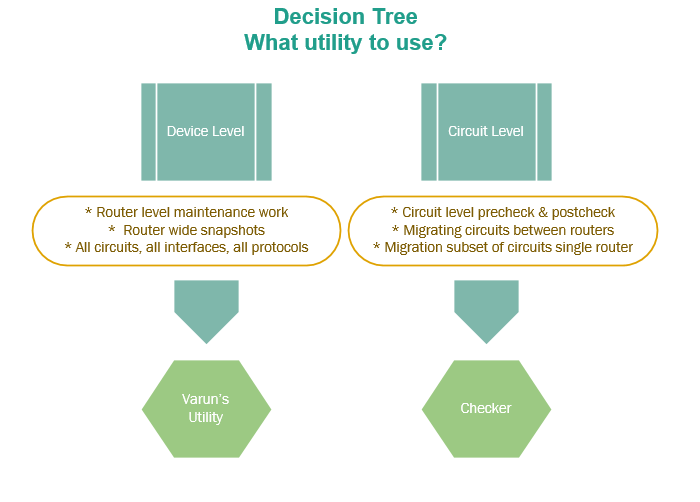

**Table of Contents**

- 1 [Sample Email](#Checker-SampleEmail)
- 2 [Document Status](#Checker-DocumentStatus)
- 3 [User Guide](#Checker-UserGuide)
  - 3.1 [Supported Services](#Checker-SupportedServices)
    - 3.1.1 [Internet Services](#Checker-InternetServices)
    - 3.1.2 [Ethernet Services](#Checker-EthernetServices)
    - 3.1.3 [Hairpin Services](#Checker-HairpinServices)
  - 3.2 [Interface Mapping Logic](#Checker-InterfaceMappingLogic)
  - 3.3 [Signature Matching Logic](#Checker-SignatureMatchingLogic)
  - 3.4 [Instruction Guide](#Checker-InstructionGuide)
    - 3.4.1 [Process Flow](#Checker-ProcessFlow)
  - 3.5
    - - 3.5.1.1 [Test Run](#Checker-TestRun)
        - 3.5.1.2 [Pre-Maintenance](#Checker-Pre-Maintenance)
        - 3.5.1.3 [Maintenance](#Checker-Maintenance)
        - 3.5.1.4 [Post-Maintenance](#Checker-Post-Maintenance)
    - 3.5.2 [Test Run Execution](#Checker-TestRunExecution)
    - 3.5.3 [Step-by-Step Instructions](#Checker-Step-by-StepInstructions)
  - 3.6
  - 3.7 [Bug List](#Checker-BugList)
  - 3.8 [Feature Request](#Checker-FeatureRequest)
- 4 [Development Guide](#Checker-DevelopmentGuide)
  - 4.1 [Supported Services - Detailed Overview](#Checker-SupportedServices-DetailedOverv)
    - 4.1.1 [Internet Services](#Checker-InternetServices.1)
    - 4.1.2 [ELINE Services](#Checker-ELINEServices)
    - 4.1.3 [ELAN Services](#Checker-ELANServices)
    - 4.1.4 [EVPL Services](#Checker-EVPLServices)
    - 4.1.5 [Hairpin Services](#Checker-HairpinServices.1)
      - 4.1.5.1 [ELINE](#Checker-ELINE)
      - 4.1.5.2 [ELAN](#Checker-ELAN)
      - 4.1.5.3 [EVPL](#Checker-EVPL)
  - 4.2 [Dependencies](#Checker-Dependencies)
  - 4.3 [Database Schema](#Checker-DatabaseSchema)
    - 4.3.1 [Run Table](#Checker-RunTable)
    - 4.3.2 [Circuit Table](#Checker-CircuitTable)
  - 4.4 [Signature Profiles](#Checker-SignatureProfiles)
  - 4.5 [Match Terms](#Checker-MatchTerms)
  - 4.6 [Profile Definitions](#Checker-ProfileDefinitions)
    - 4.6.1 [BGP](#Checker-BGP)
    - 4.6.2 [BGP IRB](#Checker-BGPIRB)
    - 4.6.3 [Static](#Checker-Static)
    - 4.6.4 [VPLS](#Checker-VPLS)
    - 4.6.5 [L2VPN](#Checker-L2VPN)
    - 4.6.6 [ELAN/EVPL Hairpin](#Checker-ELAN/EVPLHairpin)
    - 4.6.7 [ELINE Hairpin](#Checker-ELINEHairpin)
  - 4.7 [Matcher Method Inputs](#Checker-MatcherMethodInputs)
  - 4.8 [Diagrams](#Checker-Diagrams)
    - 4.8.1 [Class Layout and Structure](#Checker-ClassLayoutandStructure)
    - 4.8.2
    - 4.8.3 [Code Sequencing and Flow](#Checker-CodeSequencingandFlow)
    - 4.8.4 [Location](#Checker-Location)

# Sample Email

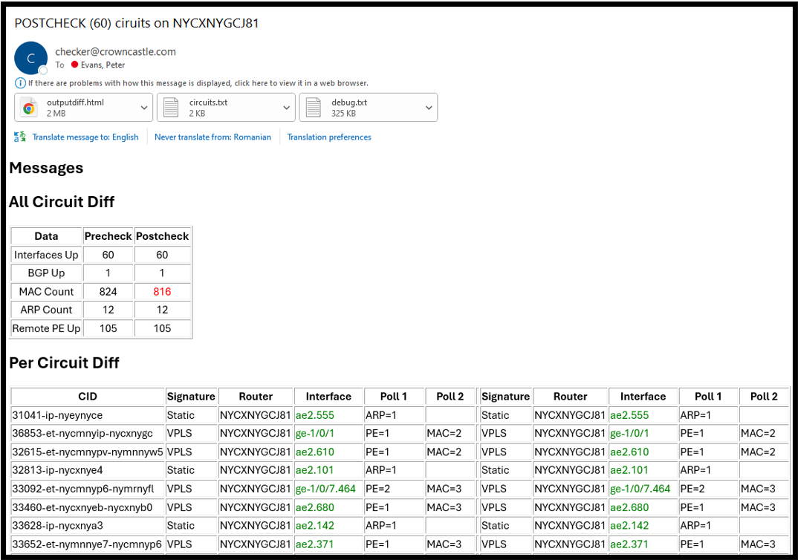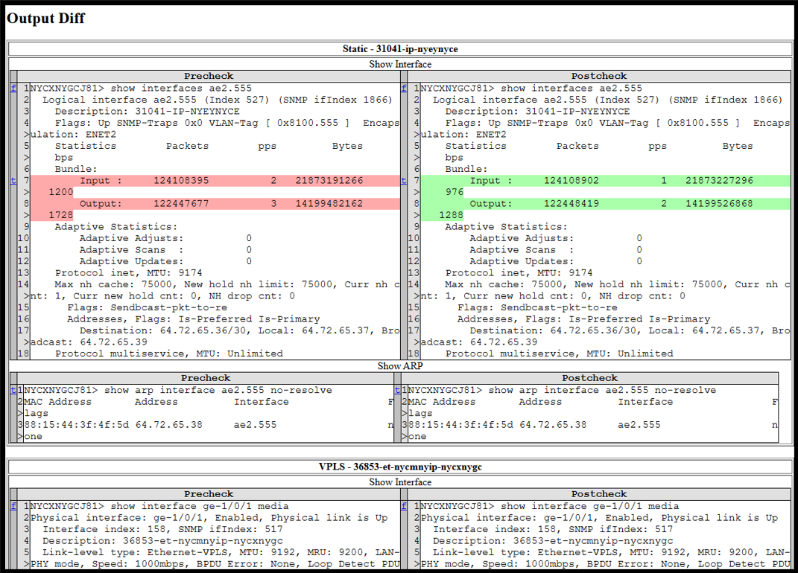

# Document Status

This Confluence page will be renewed twice per year to indicate the information within is up to date and accurate.

| Date         | Status        |
| ------------ | ------------- |
| January 2025 | &nbsp;Renewed |
| July 2025    | &nbsp;        |
| January 2026 | &nbsp;        |
| July 2026    | &nbsp;        |
| January 2027 | &nbsp;        |
| July 2027    | &nbsp;        |

# User Guide

## Supported Services

### Internet Services

| Platform | Service | Handoff Type         | Protocol  | Interface Count |
| -------- | ------- | -------------------- | --------- | --------------- |
| MX       | BGP     | Physical and Logical | BGP       | 1 Interface     |
| MX       | BGP IRB | Physical and Logical | BGP, VPLS | 1 Interface     |
| MX       | Static  | Physical and Logical | &nbsp;    | 1 Interface     |

### Ethernet Services

| Platform | Service             | Handoff Type         | Protocol    | Interface Count |
| -------- | ------------------- | -------------------- | ----------- | --------------- |
| MX       | E-LINE Multi-Router | Physical and Logical | VPLS, L2VPN | 1 Interface     |
| MX       | E-LAN Multi-Router  | Physical and Logical | VPLS        | 1 Interface     |
| MX       | EVPL Multi-Router   | Physical and Logical | VPLS, L2VPN | 1 Interface     |

### Hairpin Services

| Platform | Service              | Handoff Type         | Protocol | Interface Count |
| -------- | -------------------- | -------------------- | -------- | --------------- |
| MX       | E-LINE Single-router | Physical and Logical | VPLS     | 2 Interfaces    |
| MX       | E-LAN Single-Router  | Physical and Logical | VPLS     | 1 Interface     |
| MX       | EVPL Single-Router   | Physical and Logical | VPLS     | 1 Interface     |

## Interface Mapping Logic

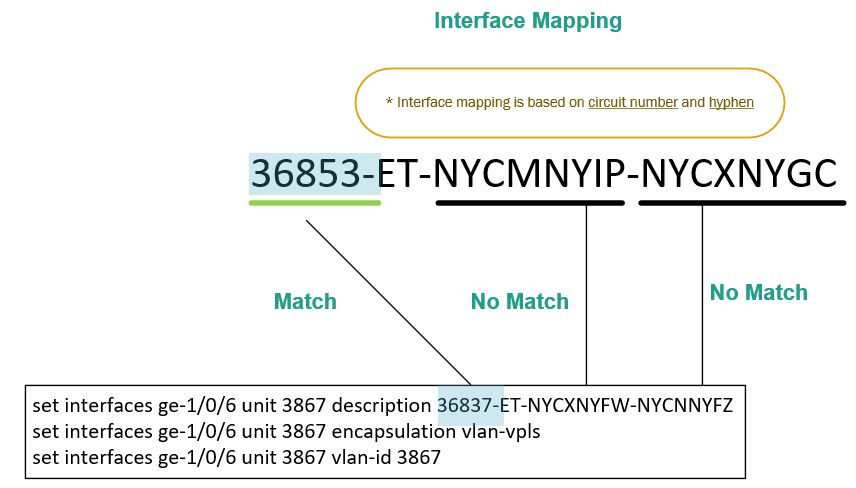

## Signature Matching Logic

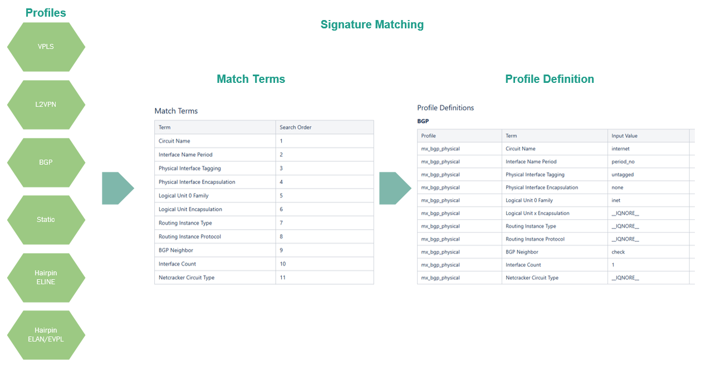

## Instruction Guide

### Process Flow

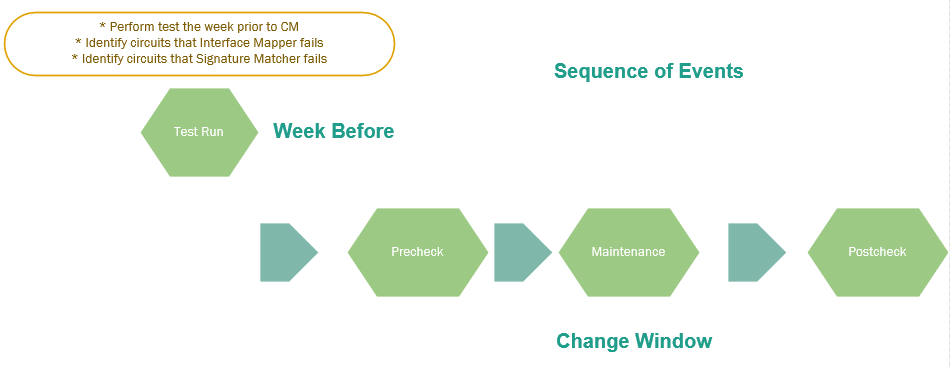

#### Test Run

1. Perform test run the week prior to change management window to identify circuits that failed on interface mapping or signature matching

#### Pre-Maintenance

1. Perform a precheck prior to starting maintenance window

#### Maintenance

1. Perform maintenance work

#### Post-Maintenance

1. Perform a postcheck at conclusion of maintenance work

### Test Run Execution

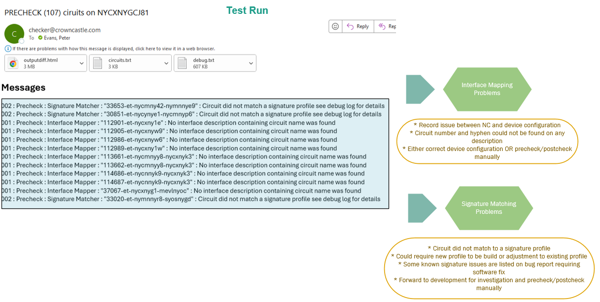

### Step-by-Step Instructions

1. Click link to open Checker utility

1. Enter circuit list, select run mode, enter device name, and click build

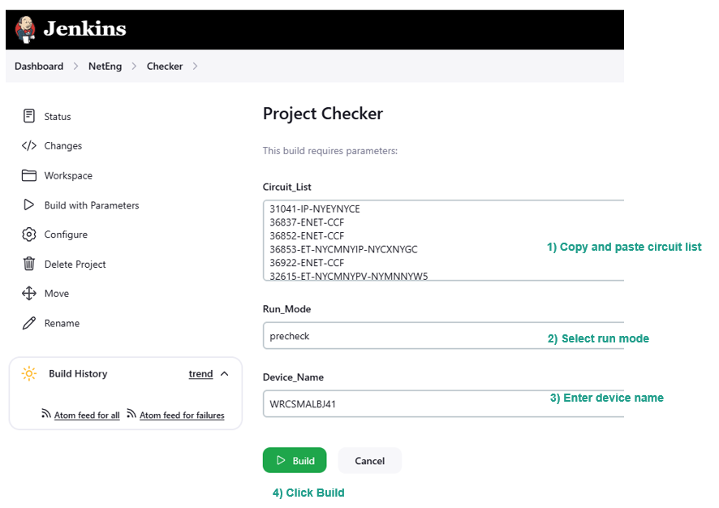

1. Open console output

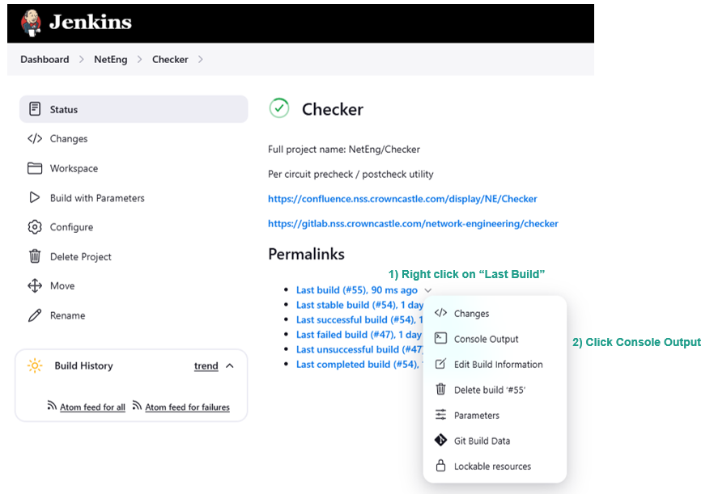

1. Monitor console output

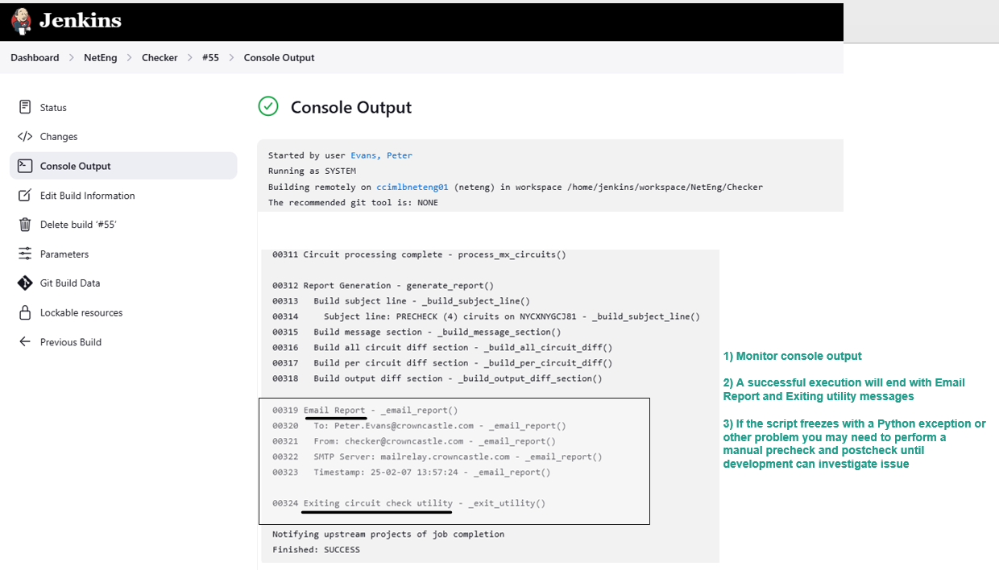

1. Checker will automatically send you a email report which typically arrives in 60 seconds

2. The report will contain the following sections and information

- All Circuit Diff Table
- Per Circuit Diff Table
- Attached Output Diff
- Attached Circuit List
- Attached Debug for troubleshooting

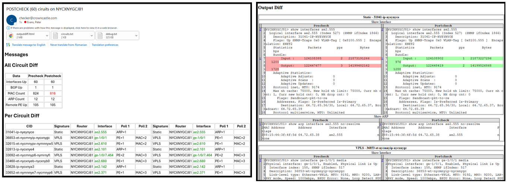

## Bug List

| Date      | Status | Bug ID | Description                                                                                                                                                               |
| --------- | ------ | ------ | ------------------------------------------------------------------------------------------------------------------------------------------------------------------------- |
| 2/19/2025 | New    | 100    | EVPL signature profile will not match EVPL circuit with a protect path                                                                                                    |
| 2/19/2025 | New    | 101    | EVPL signature profile will not match when EVPL node is on same box with EVPL head and there is also remote EVPL nodes. Discovered Checker Review EA 02-14-2025 11-00-AM. |
| 2/19/2025 | New    | 102    | ELAN interface mapping will not map when ELAN is split out using VLAN's in aggregation stack passing over a single aggregation stack interface to MX                      |
| 2/19/2025 | New    | 103    | ELINE hairpin output diff is only showing interface 1                                                                                                                     |
| 2/19/2025 | New    | 104    | Poll data maybe incorrect if interface is in a deactivated routing instance                                                                                               |
| 2/19/2025 | New    | 105    | Utility will quit with Python exception if a IPB circuit is included in list. Discovered Checker Review AP 02-14-2025 11-20-AM                                            |
| 2/20/2025 | New    | 106    | Circuit names with spaces are being broken into separate circuits only the first string is matching the remaining cause log messages                                      |
|           |        |        |                                                                                                                                                                           |
|           |        |        |                                                                                                                                                                           |
|           |        |        |                                                                                                                                                                           |
|           |        |        |                                                                                                                                                                           |
|           |        |        |                                                                                                                                                                           |
|           |        |        |                                                                                                                                                                           |

## Feature Request

| Date      | Status | Request ID | Description                                                                                                       |
| --------- | ------ | ---------- | ----------------------------------------------------------------------------------------------------------------- |
| 2/19/2025 | New    | 100        | Add support for IPB                                                                                               |
| 2/19/2025 | New    | 101        | Add support for aggregation trunk                                                                                 |
| 2/19/2025 | New    | 102        | Add support for CPE trunk                                                                                         |
| 2/19/2025 | New    | 103        | Add support for customer NNI                                                                                      |
| 2/19/2025 | New    | 104        | Add support for BGP IRB VPLS                                                                                      |
| 2/19/2025 | New    | 105        | Add support for OOB management circuit. Discovered Checker Review AP 02-14-2025 11-20-AM                          |
| 2/19/2025 | New    | 106        | Add support for in-band CPE management circuit testing. Discovered Checker Review AP 02-14-2025 11-20-AM          |
| 2/20/2025 | New    | 107        | Add support for Sidera circuits ex. 10/LCRM/000069/OED. Discovered Checker Review AP 02-14-2025 11-20-AM          |
| 2/20/2025 | New    | 108        | Add support for TMO high/low interfaces using same circuit name. Discovered Checker Review AP 02-14-2025 11-20-AM |
| 2/20/2025 | New    | 109        | Add support for Fibertech circuits ex. KRCEETHTP2NHV.00001. Discovered Checker Review AP 02-14-2025 11-20-AM      |
|           |        |            |                                                                                                                   |
|           |        |            |                                                                                                                   |
|           |        |            |                                                                                                                   |
|           |        |            |                                                                                                                   |
|           |        |            |                                                                                                                   |
|           |        |            |                                                                                                                   |
|           |        |            |                                                                                                                   |

# Development Guide

## Supported Services - Detailed Overview

### Internet Services

| Platform | Category         | Service Type | Router Count | Interface Count          | Physical Interface | Protocol | Signature Profile | Polling Data              |
| -------- | ---------------- | ------------ | ------------ | ------------------------ | ------------------ | -------- | ----------------- | ------------------------- |
| MX       | Customer Circuit | BGP          | n/a          | 1 Circuit to 1 Interface | Untagged           | BGP      | mx_bgp            | Physical Interface Status |
| &nbsp;   | &nbsp;           | &nbsp;       | &nbsp;       | &nbsp;                   | &nbsp;             | &nbsp;   | &nbsp;            | BGP Neighbor State        |
| MX       | Customer Circuit | BGP          | n/a          | 1 Circuit to 1 Interface | Tagged             | BGP      | mx_bgp            | Logical Interface Status  |
| &nbsp;   | &nbsp;           | &nbsp;       | &nbsp;       | &nbsp;                   | &nbsp;             | &nbsp;   | &nbsp;            | BGP Neighbor State        |
| MX       | Customer Circuit | BGP IRB      | n/a          | 1 Circuit to 1 Interface | Untagged           | BGP      | mx_bgp_irb        | Physical Interface Status |
| &nbsp;   | &nbsp;           | &nbsp;       | &nbsp;       | &nbsp;                   | &nbsp;             | &nbsp;   | &nbsp;            | BGP Neighbor State        |
| MX       | Customer Circuit | BGP IRB      | n/a          | 1 Circuit to 1 Interface | Tagged             | BGP      | mx_bgp_irb        | Logical Interface Status  |
| &nbsp;   | &nbsp;           | &nbsp;       | &nbsp;       | &nbsp;                   | &nbsp;             | &nbsp;   | &nbsp;            | BGP Neighbor State        |
| MX       | Customer Circuit | Static       | n/a          | 1 Circuit to 1 Interface | Untagged           | &nbsp;   | mx_static         | Physical Interface Status |
| &nbsp;   | &nbsp;           | &nbsp;       | &nbsp;       | &nbsp;                   | &nbsp;             | &nbsp;   | &nbsp;            | ARP Count                 |
| MX       | Customer Circuit | Static       | n/a          | 1 Circuit to 1 Interface | Tagged             | &nbsp;   | mx_static         | Logical Interface Status  |
| &nbsp;   | &nbsp;           | &nbsp;       | &nbsp;       | &nbsp;                   | &nbsp;             | &nbsp;   | &nbsp;            | ARP Count                 |

### ELINE Services

| Platform | Category         | Service Type | Router Count | Interface Count          | Physical Interface | Protocol | Signature Profile | Polling Data              |
| -------- | ---------------- | ------------ | ------------ | ------------------------ | ------------------ | -------- | ----------------- | ------------------------- |
| MX       | Customer Circuit | E-LINE       | Multi Router | 1 Circuit to 1 Interface | Untagged           | VPLS     | mx_vpls           | Physical Interface Status |
| &nbsp;   | &nbsp;           | &nbsp;       | &nbsp;       | &nbsp;                   | &nbsp;             | &nbsp;   | &nbsp;            | MAC Count                 |
| &nbsp;   | &nbsp;           | &nbsp;       | &nbsp;       | &nbsp;                   | &nbsp;             | &nbsp;   | &nbsp;            | Number of Remote PE's Up  |
| MX       | Customer Circuit | E-LINE       | Multi Router | 1 Circuit to 1 Interface | Tagged             | VPLS     | mx_vpls           | Logical Interface Status  |
| &nbsp;   | &nbsp;           | &nbsp;       | &nbsp;       | &nbsp;                   | &nbsp;             | &nbsp;   | &nbsp;            | MAC Count                 |
| &nbsp;   | &nbsp;           | &nbsp;       | &nbsp;       | &nbsp;                   | &nbsp;             | &nbsp;   | &nbsp;            | Number of Remote PE's Up  |
| MX       | Customer Circuit | E-LINE       | Multi Router | 1 Circuit to 1 Interface | Untagged           | L2VPN    | mx_l2vpn          | Physical Interface Status |
| &nbsp;   | &nbsp;           | &nbsp;       | &nbsp;       | &nbsp;                   | &nbsp;             | &nbsp;   | &nbsp;            | Number of Remote PE's Up  |
| MX       | Customer Circuit | E-LINE       | Multi Router | 1 Circuit to 1 Interface | Tagged             | L2VPN    | mx_l2vpn          | Logical Interface Status  |
| &nbsp;   | &nbsp;           | &nbsp;       | &nbsp;       | &nbsp;                   | &nbsp;             | &nbsp;   | &nbsp;            | Number of Remote PE's Up  |

### ELAN Services

| Platform | Category         | Service Type | Router Count | Interface Count          | Physical Interface | Protocol | Signature Profile | Polling Data              |
| -------- | ---------------- | ------------ | ------------ | ------------------------ | ------------------ | -------- | ----------------- | ------------------------- |
| MX       | Customer Circuit | E-LAN        | Multi Router | 1 Circuit to 1 Interface | Untagged           | VPLS     | mx_vpls           | Physical Interface Status |
| &nbsp;   | &nbsp;           | &nbsp;       | &nbsp;       | &nbsp;                   | &nbsp;             | &nbsp;   | &nbsp;            | MAC Count                 |
| &nbsp;   | &nbsp;           | &nbsp;       | &nbsp;       | &nbsp;                   | &nbsp;             | &nbsp;   | &nbsp;            | Number of Remote PE's Up  |
| MX       | Customer Circuit | E-LAN        | Multi Router | 1 Circuit to 1 Interface | Tagged             | VPLS     | mx_vpls           | Logical Interface Status  |
| &nbsp;   | &nbsp;           | &nbsp;       | &nbsp;       | &nbsp;                   | &nbsp;             | &nbsp;   | &nbsp;            | MAC Count                 |
| &nbsp;   | &nbsp;           | &nbsp;       | &nbsp;       | &nbsp;                   | &nbsp;             | &nbsp;   | &nbsp;            | Number of Remote PE's Up  |

### EVPL Services

| Platform | Category         | Service Type | Router Count | Circuit to Interface     | Physical Interface | Protocol | Signature Profile | Polling Data              |
| -------- | ---------------- | ------------ | ------------ | ------------------------ | ------------------ | -------- | ----------------- | ------------------------- |
| MX       | Customer Circuit | EVPL         | Multi Router | 1 Circuit to 1 Interface | Untagged           | VPLS     | mx_vpls           | Physical Interface Status |
| &nbsp;   | &nbsp;           | &nbsp;       | &nbsp;       | &nbsp;                   | &nbsp;             | &nbsp;   | &nbsp;            | MAC Count                 |
| &nbsp;   | &nbsp;           | &nbsp;       | &nbsp;       | &nbsp;                   | &nbsp;             | &nbsp;   | &nbsp;            | Number of Remote PE's Up  |
| MX       | Customer Circuit | EVPL         | Multi Router | 1 Circuit to 1 Interface | Tagged             | VPLS     | mx_vpls           | Logical Interface Status  |
| &nbsp;   | &nbsp;           | &nbsp;       | &nbsp;       | &nbsp;                   | &nbsp;             | &nbsp;   | &nbsp;            | MAC Count                 |
| &nbsp;   | &nbsp;           | &nbsp;       | &nbsp;       | &nbsp;                   | &nbsp;             | &nbsp;   | &nbsp;            | Number of Remote PE's Up  |

### Hairpin Services

#### ELINE

| Platform | Category         | Service Type | Router Count  | Interface Count           | Physical Interface | Protocol | Signature Profile | Polling Data              |
| -------- | ---------------- | ------------ | ------------- | ------------------------- | ------------------ | -------- | ----------------- | ------------------------- |
| MX       | Customer Circuit | E-LINE       | Single Router | 1 Circuit to 2 Interfaces | Untagged           | VPLS     | mx_eline_hairpin  | Physical Interface Status |
| &nbsp;   | &nbsp;           | &nbsp;       | &nbsp;        | &nbsp;                    | &nbsp;             | &nbsp;   | &nbsp;            | MAC Count                 |
| MX       | Customer Circuit | E-LINE       | Single Router | 1 Circuit to 2 Interfaces | Tagged             | VPLS     | mx_eline_hairpin  | Logical Interface Status  |
| &nbsp;   | &nbsp;           | &nbsp;       | &nbsp;        | &nbsp;                    | &nbsp;             | &nbsp;   | &nbsp;            | MAC Count                 |

#### ELAN

| Platform | Category         | Service Type | Router Count  | Interface Count          | Physical Interface | Protocol | Signature Profile    | Polling Data              |
| -------- | ---------------- | ------------ | ------------- | ------------------------ | ------------------ | -------- | -------------------- | ------------------------- |
| MX       | Customer Circuit | E-LAN        | Single Router | 1 Circuit to 1 Interface | Untagged           | VPLS     | mx_elan_evpl_hairpin | Physical Interface Status |
| &nbsp;   | &nbsp;           | &nbsp;       | &nbsp;        | &nbsp;                   | &nbsp;             | &nbsp;   | &nbsp;               | MAC Count                 |
| MX       | Customer Circuit | E-LAN        | Single Router | 1 Circuit to 1 Interface | Tagged             | VPLS     | mx_elan_evpl_hairpin | Logical Interface Status  |
| &nbsp;   | &nbsp;           | &nbsp;       | &nbsp;        | &nbsp;                   | &nbsp;             | &nbsp;   | &nbsp;               | MAC Count                 |

#### EVPL

| Platform | Category         | Service Type | Router Count  | Interface Count          | Physical Interface | Protocol | Signature Profile    | Polling Data              |
| -------- | ---------------- | ------------ | ------------- | ------------------------ | ------------------ | -------- | -------------------- | ------------------------- |
| MX       | Customer Circuit | EVPL         | Single Router | 1 Circuit to 1 Interface | Untagged           | VPLS     | mx_elan_evpl_hairpin | Physical Interface Status |
| &nbsp;   | &nbsp;           | &nbsp;       | &nbsp;        | &nbsp;                   | &nbsp;             | &nbsp;   | &nbsp;               | MAC Count                 |
| MX       | Customer Circuit | EVPL         | Single Router | 1 Circuit to 1 Interface | Tagged             | VPLS     | mx_elan_evpl_hairpin | Logical Interface Status  |
| &nbsp;   | &nbsp;           | &nbsp;       | &nbsp;        | &nbsp;                   | &nbsp;             | &nbsp;   | &nbsp;               | MAC Count                 |

## Dependencies

| SMTP Server           | [mailrelay.crowncastle.com](http://mailrelay.crowncastle.com/)        |
| --------------------- | --------------------------------------------------------------------- |
| NSS Microservices     | [grpcui.nss.crowncastle.com](http://grpcui.nss.crowncastle.com/):9090 |
| Netcracker REST API   | 10.48.0.61                                                            |
| Neteng Server         | ccimlbneteng01                                                        |
| Jenkins               | [jenkins.nss.crowncastle.com](http://jenkins.nss.crowncastle.com/)    |
| Gitlab                | [gitlab.nss.crowncastle.com](http://gitlab.nss.crowncastle.com/)      |
| Netcracker            | &nbsp;                                                                |
| NE Automation Account | &nbsp;zccfautobot                                                     |

## Database Schema

### Run Table

| Table Column                 | Data Type               |
| ---------------------------- | ----------------------- |
| row_id                       | Primary Key             |
| user_run_mode                | String                  |
| user_email_address           | String                  |
| user_circuit_list            | JSON encoded list       |
| device_name                  | String                  |
| device_model                 | String                  |
| time                         | String                  |
| date                         | String                  |
| mx_interface_polls_precheck  | JSON encoded dictionary |
| mx_interface_polls_postcheck | JSON encoded dictionary |

### Circuit Table

| Table Column                                  | Data Type               |
| --------------------------------------------- | ----------------------- |
| row_id                                        | Primary Key             |
| run_table_row_id_last_precheck                | Foreign key             |
| run_table_row_id_last_postcheck               | Foreign key             |
| circuit_name                                  | String                  |
| service_type_precheck                         | String                  |
| service_type_postcheck                        | String                  |
| device_name_precheck                          | String                  |
| device_name_postcheck                         | String                  |
| device_model_precheck                         | String                  |
| device_model_postcheck                        | String                  |
| mx_circuit_interfaces_precheck                | JSON encoded dictionary |
| mx_circuit_interfaces_postcheck               | JSON encoded dictionary |
| mx_bgp_neighbor_state_precheck                | String                  |
| mx_bgp_show_neighbor_state_precheck           | String                  |
| mx_bgp_neighbor_state_postcheck               | String                  |
| mx_bgp_show_neighbor_state_postcheck          | String                  |
| mx_bgp_irb_neighbor_state_precheck            | String                  |
| mx_bgp_irb_show_neighbor_state_precheck       | String                  |
| mx_bgp_irb_neighbor_state_postcheck           | String                  |
| mx_bgp_irb_show_neighbor_state_postcheck      | String                  |
| mx_static_arp_count_precheck                  | String                  |
| mx_static_show_arp_count_precheck             | String                  |
| mx_static_arp_count_postcheck                 | String                  |
| mx_static_show_arp_count_postcheck            | String                  |
| mx_vpls_number_remote_pe_up_precheck          | String                  |
| mx_vpls_show_number_remote_pe_up_precheck     | String                  |
| mx_vpls_number_remote_pe_up_postcheck         | String                  |
| mx_vpls_show_number_remote_pe_up_postcheck    | String                  |
| mx_vpls_mac_count_precheck                    | String                  |
| mx_vpls_show_mac_count_precheck               | String                  |
| mx_vpls_mac_count_postcheck                   | String                  |
| mx_vpls_show_mac_count_postcheck              | String                  |
| mx_l2vpn_number_remote_pe_up_precheck         | String                  |
| mx_l2vpn_show_number_remote_pe_up_precheck    | String                  |
| mx_l2vpn_number_remote_pe_up_postcheck        | String                  |
| mx_l2vpn_show_number_remote_pe_up_postcheck   | String                  |
| mx_hairpin_eline_mac_count_precheck           | String                  |
| mx_hairpin_eline_show_mac_count_precheck      | String                  |
| mx_hairpin_eline_mac_count_postcheck          | String                  |
| mx_hairpin_eline_show_mac_count_postcheck     | String                  |
| mx_hairpin_elan_evpl_mac_count_precheck       | String                  |
| mx_hairpin_elan_evpl_show_mac_count_precheck  | String                  |
| mx_hairpin_elan_evpl_mac_count_postcheck      | String                  |
| mx_hairpin_elan_evpl_show_mac_count_postcheck | String                  |

## Signature Profiles

| Profile Name                  | Search Order |
| ----------------------------- | ------------ |
| mx_vpls_logical               | 1            |
| mx_static_logical             | 2            |
| mx_bgp_logical                | 3            |
| mx_eline_hairpin              | 4            |
| mx_elan_evpl_hairpin_logical  | 5            |
| mx_l2vpn_logical              | 6            |
| mx_bgp_irb_vpls_logical       | 7            |
| mx_vpls_physical              | 8            |
| mx_static_physical            | 9            |
| mx_bgp_physical               | 10           |
| mx_elan_evpl_hairpin_physical | 11           |
| mx_l2vpn_physical             | 12           |
| mx_bgp_irb_vpls_physical      | 13           |

## Match Terms

| Term                             | Search Order |
| -------------------------------- | ------------ |
| Circuit Name                     | 1            |
| Interface Name Period            | 2            |
| Physical Interface Tagging       | 3            |
| Physical Interface Encapsulation | 4            |
| Logical Unit 0 Family            | 5            |
| Logical Unit Encapsulation       | 6            |
| Routing Instance Type            | 7            |
| Routing Instance Protocol        | 8            |
| BGP Neighbor                     | 9            |
| Interface Count                  | 10           |
| Netcracker Circuit Type          | 11           |

## Profile Definitions

### BGP

| Profile         | Term                             | Input Value |     | Profile        | Term                             | Input Value                              |
| --------------- | -------------------------------- | ----------- | --- | -------------- | -------------------------------- | ---------------------------------------- |
| mx_bgp_physical | Circuit Name                     | internet    |     | mx_bgp_logical | Circuit Name                     | internet                                 |
| mx_bgp_physical | Interface Name Period            | period_no   |     | mx_bgp_logical | Interface Name Period            | period_yes                               |
| mx_bgp_physical | Physical Interface Tagging       | untagged    |     | mx_bgp_logical | Physical Interface Tagging       | tagged                                   |
| mx_bgp_physical | Physical Interface Encapsulation | none        |     | mx_bgp_logical | Physical Interface Encapsulation | \[flexible-ethernet-services,vlan-vpls\] |
| mx_bgp_physical | Logical Unit 0 Family            | inet        |     | mx_bgp_logical | Logical Unit 0 Family            | \__IQNORE__                              |
| mx_bgp_physical | Logical Unit x Encapsulation     | \__IQNORE__ |     | mx_bgp_logical | Logical Unit x Encapsulation     | none                                     |
| mx_bgp_physical | Routing Instance Type            | \__IQNORE__ |     | mx_bgp_logical | Routing Instance Type            | \__IQNORE__                              |
| mx_bgp_physical | Routing Instance Protocol        | \__IQNORE__ |     | mx_bgp_logical | Routing Instance Protocol        | \__IQNORE__                              |
| mx_bgp_physical | BGP Neighbor                     | check       |     | mx_bgp_logical | BGP Neighbor Check               | check                                    |
| mx_bgp_physical | Interface Count                  | 1           |     | mx_bgp_logical | Interface Count                  | 1                                        |
| mx_bgp_physical | Netcracker Circuit Type          | \__IQNORE__ |     | mx_bgp_logical | Netcracker Circuit Type          | \__IQNORE__                              |

### BGP IRB

| Profile                  | Term                             | Input Value   |     | Profile                 | Term                             | Input Value                              |
| ------------------------ | -------------------------------- | ------------- | --- | ----------------------- | -------------------------------- | ---------------------------------------- |
| mx_bgp_irb_vpls_physical | Circuit Name                     | internet      |     | mx_bgp_irb_vpls_logical | Circuit Name                     | internet                                 |
| mx_bgp_irb_vpls_physical | Physical Interface Tagging       | untagged      |     | mx_bgp_irb_vpls_logical | Physical Interface Tagging       | tagged                                   |
| mx_bgp_irb_vpls_physical | Physical Interface Encapsulation | ethernet-vpls |     | mx_bgp_irb_vpls_logical | Physical Interface Encapsulation | \[flexible-ethernet-services,vlan-vpls\] |
| mx_bgp_irb_vpls_physical | Logical Unit 0 Family            | vpls          |     | mx_bgp_irb_vpls_logical | Logical Unit 0 Family            | \__IQNORE__                              |
| mx_bgp_irb_vpls_physical | Logical Unit x Encapsulation     | \__IQNORE__   |     | mx_bgp_irb_vpls_logical | Logical Unit x Encapsulation     | vlan-vpls                                |
| mx_bgp_irb_vpls_physical | Routing Instance Type            | \__IQNORE__   |     | mx_bgp_irb_vpls_logical | Routing Instance Type            | \__IQNORE__                              |
| mx_bgp_irb_vpls_physical | Routing Instance Protocol        | \__IQNORE__   |     | mx_bgp_irb_vpls_logical | Routing Instance Protocol        | \__IQNORE__                              |
| mx_bgp_irb_vpls_physical | BGP Neighbor                     | \__IQNORE__   |     | mx_bgp_irb_vpls_logical | BGP Neighbor                     | \__IQNORE__                              |
| mx_bgp_irb_vpls_physical | Interface Count                  | 1             |     | mx_bgp_irb_vpls_logical | Interface Count                  | 1                                        |
| mx_bgp_irb_vpls_physical | Netcracker Circuit Type          | \__IQNORE__   |     | mx_bgp_irb_vpls_logical | Netcracker Circuit Type          | \__IQNORE__                              |

### Static

| Profile            | Term                             | Input Value |     | Profile           | Term                             | Input Value                    |
| ------------------ | -------------------------------- | ----------- | --- | ----------------- | -------------------------------- | ------------------------------ |
| mx_static_physical | Circuit Name                     | internet    |     | mx_static_logical | Circuit Name                     | internet                       |
| mx_static_physical | Physical Interface Tagging       | untagged    |     | mx_static_logical | Physical Interface Tagging       | tagged                         |
| mx_static_physical | Physical Interface Encapsulation | none        |     | mx_static_logical | Physical Interface Encapsulation | \[flexible-ethernet-services\] |
| mx_static_physical | Logical Unit 0 Family            | inet        |     | mx_static_logical | Logical Unit 0 Family            | \__IQNORE__                    |
| mx_static_physical | Logical Unit x Encapsulation     | \__IQNORE__ |     | mx_static_logical | Logical Unit x Encapsulation     | none                           |
| mx_static_physical | Routing Instance Type            | \__IQNORE__ |     | mx_static_logical | Routing Instance Type            | \__IQNORE__                    |
| mx_static_physical | Routing Instance Protocol        | \__IQNORE__ |     | mx_static_logical | Routing Instance Protocol        | \__IQNORE__                    |
| mx_static_physical | BGP Neighbor                     | \__IQNORE__ |     | mx_static_logical | BGP Neighbor                     | \__IQNORE__                    |
| mx_static_physical | Interface Count                  | 1           |     | mx_static_logical | Interface Count                  | 1                              |
| mx_static_physical | Netcracker Circuit Type          | \__IQNORE__ |     | mx_static_logical | Netcracker Circuit Type          | \__IQNORE__                    |

### VPLS

| Profile          | Term                             | Input Value   |     | Profile         | Term                             | Input Value                              |
| ---------------- | -------------------------------- | ------------- | --- | --------------- | -------------------------------- | ---------------------------------------- |
| mx_vpls_physical | Circuit Name                     | ethernet      |     | mx_vpls_logical | Circuit Name                     | ethernet                                 |
| mx_vpls_physical | Interface Name Period            | period_no     |     | mx_vpls_logical | Interface Name Period            | period_yes                               |
| mx_vpls_physical | Physical Interface Tagging       | untagged      |     | mx_vpls_logical | Physical Interface Tagging       | tagged                                   |
| mx_vpls_physical | Physical Interface Encapsulation | ethernet-vpls |     | mx_vpls_logical | Physical Interface Encapsulation | \[flexible-ethernet-services,vlan-vpls\] |
| mx_vpls_physical | Logical Unit 0 Family            | vpls          |     | mx_vpls_logical | Logical Unit 0 Family            | \__IQNORE__                              |
| mx_vpls_physical | Logical Unit x Encapsulation     | \__IQNORE__   |     | mx_vpls_logical | Logical Unit x Encapsulation     | vlan-vpls                                |
| mx_vpls_physical | Routing Instance Type            | vpls          |     | mx_vpls_logical | Routing Instance Type            | vpls                                     |
| mx_vpls_physical | Routing Instance Protocol        | vpls          |     | mx_vpls_logical | Routing Instance Protocol        | vpls                                     |
| mx_vpls_physical | BGP Neighbor                     | \__IQNORE__   |     | mx_vpls_logical | BGP Neighbor                     | \__IQNORE__                              |
| mx_vpls_physical | Interface Count                  | 1             |     | mx_vpls_logical | Interface Count                  | 1                                        |
| mx_vpls_physical | Netcracker Circuit Type          | \__IQNORE__   |     | mx_vpls_logical | Netcracker Circuit Type          | \__IQNORE__                              |

### L2VPN

| Profile           | Term                             | Input Value  |     | Profile          | Term                             | Input Value                             |
| ----------------- | -------------------------------- | ------------ | --- | ---------------- | -------------------------------- | --------------------------------------- |
| mx_l2vpn_physical | Circuit Name                     | ethernet     |     | mx_l2vpn_logical | Circuit Name                     | ethernet                                |
| mx_l2vpn_physical | Physical Interface Tagging       | untagged     |     | mx_l2vpn_logical | Physical Interface Tagging       | tagged                                  |
| mx_l2vpn_physical | Physical Interface Encapsulation | ethernet-ccc |     | mx_l2vpn_logical | Physical Interface Encapsulation | \[flexible-ethernet-services,vlan-ccc\] |
| mx_l2vpn_physical | Logical Unit 0 Family            | ccc          |     | mx_l2vpn_logical | Logical Unit 0 Family            | \__IQNORE__                             |
| mx_l2vpn_physical | Logical Unit x Encapsulation     | \__IQNORE__  |     | mx_l2vpn_logical | Logical Unit x Encapsulation     | vlan-ccc                                |
| mx_l2vpn_physical | Routing Instance Type            | l2vpn        |     | mx_l2vpn_logical | Routing Instance Type            | l2vpn                                   |
| mx_l2vpn_physical | Routing Instance Protocol        | l2vpn        |     | mx_l2vpn_logical | Routing Instance Protocol        | l2vpn                                   |
| mx_l2vpn_physical | BGP Neighbor                     | \__IQNORE__  |     | mx_l2vpn_logical | BGP Neighbor                     | \__IQNORE__                             |
| mx_l2vpn_physical | Interface Count                  | 1            |     | mx_l2vpn_logical | Interface Count                  | 1                                       |
| mx_l2vpn_physical | Netcracker Circuit Type          | \__IQNORE__  |     | mx_l2vpn_logical | Netcracker Circuit Type          | \__IQNORE__                             |

### ELAN/EVPL Hairpin

| Profile                       | Term                             | Input Value   |     | Profile                      | Term                             | Input Value                              |
| ----------------------------- | -------------------------------- | ------------- | --- | ---------------------------- | -------------------------------- | ---------------------------------------- |
| mx_elan_evpl_hairpin_physical | Circuit Name                     | ethernet      |     | mx_elan_evpl_hairpin_logical | Circuit Name                     | ethernet                                 |
| mx_elan_evpl_hairpin_physical | Physical Interface Tagging       | untagged      |     | mx_elan_evpl_hairpin_logical | Physical Interface Tagging       | tagged                                   |
| mx_elan_evpl_hairpin_physical | Physical Interface Encapsulation | ethernet-vpls |     | mx_elan_evpl_hairpin_logical | Physical Interface Encapsulation | \[flexible-ethernet-services,vlan-vpls\] |
| mx_elan_evpl_hairpin_physical | Logical Unit 0 Family            | vpls          |     | mx_elan_evpl_hairpin_logical | Logical Unit 0 Family            | \__IQNORE__                              |
| mx_elan_evpl_hairpin_physical | Logical Unit x Encapsulation     | \__IQNORE__   |     | mx_elan_evpl_hairpin_logical | Logical Unit x Encapsulation     | vlan-vpls                                |
| mx_elan_evpl_hairpin_physical | Routing Instance Type            | vpls          |     | mx_elan_evpl_hairpin_logical | Routing Instance Type            | vpls                                     |
| mx_elan_evpl_hairpin_physical | Routing Instance Protocol        | none          |     | mx_elan_evpl_hairpin_logical | Routing Instance Protocol        | none                                     |
| mx_elan_evpl_hairpin_physical | BGP Neighbor                     | \__IQNORE__   |     | mx_elan_evpl_hairpin_logical | BGP Neighbor                     | \__IQNORE__                              |
| mx_elan_evpl_hairpin_physical | Interface Count                  | 1             |     | mx_elan_evpl_hairpin_logical | Interface Count                  | 1                                        |
| mx_elan_evpl_hairpin_physical | Netcracker Circuit Type          | elan, evpl    |     | mx_elan_evpl_hairpin_logical | Netcracker Circuit Type          | elan, evpl                               |

### ELINE Hairpin

| Profile          | Term                             | Input Value   |
| ---------------- | -------------------------------- | ------------- |
| mx_eline_hairpin | Circuit Name                     | ethernet      |
| mx_eline_hairpin | Physical Interface Tagging       | untagged      |
| mx_eline_hairpin | Physical Interface Encapsulation | ethernet-vpls |
| mx_eline_hairpin | Logical Unit 0 Family            | vpls          |
| mx_eline_hairpin | Logical Unit x Encapsulation     | \__IQNORE__   |
| mx_eline_hairpin | Routing Instance Type            | none          |
| mx_eline_hairpin | Routing Instance Protocol        | none          |
| mx_eline_hairpin | BGP Neighbor                     | \__IQNORE__   |
| mx_eline_hairpin | Interface Count                  | 2             |
| mx_eline_hairpin | Netcracker Circuit Type          | \[eline\]     |

## Matcher Method Inputs

## Diagrams

### Class Layout and Structure

### Code Sequencing and Flow

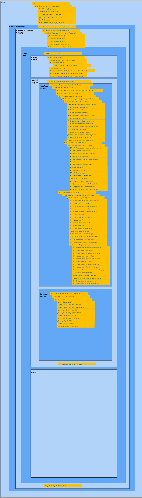

### Location

All the Visio diagrams on this page can be found in the following file on sharepoint.

[Checker Diagrams.vsdx](https://crowncastle.sharepoint.com/:u:/r/sites/NetEng/Public/Automation/Checker/Checker%20Diagrams.vsdx?d=w22ebe9ea9e4c470bbef09c5055b63cd9&csf=1&web=1&e=pzIjgO)
